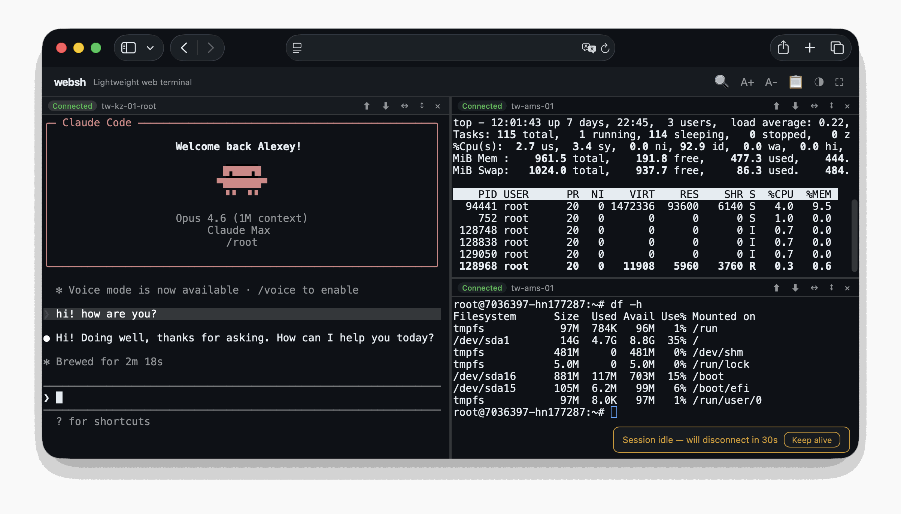

#  websh

**English** | [Русский](README.ru.md)

Browser-based SSH terminal. Plain HTTP, no build, no extra services.

- 📦 No npm, no pip — drop the files in and run
- 🌐 Corporate networks with only HTTPS open: works without WebSocket
- ⭐ Sessions survive tab close, reboot, and backend restart for up to 72 h (via tmux on the target host)



```
┌─ Your browser ─┐    HTTPS     ┌── websh host ──┐     SSH      ┌──── Remote ────┐
│                │              │                │              │                │
│    xterm.js    │─── POST ────►│   server.py    │◄────────────►│      bash      │
│                │◄─── SSE ─────│    (Python)    │              │     + tmux     │
│                │              │                │              │                │
└────────────────┘              └────────────────┘              └────────────────┘
```

## How it works

Three pieces:

- **Browser.** xterm.js renders the terminal. Each keystroke goes up as a POST to `/api/input`.
- **websh host.** `server.py` runs each SSH connection as a PTY subprocess and streams output back over Server-Sent Events on `/api/stream`. The same process serves the frontend, so you don't need a separate web server.
- **Remote.** The host you SSH into. Optionally wrapped in tmux so the session survives reconnects.

If a proxy buffers SSE (some shared hosts do), the client falls back to long-polling on `/api/output` for that session. Slower, but works.

Shared hosting that doesn't allow long-lived processes? Ship `api.php` next to `server.py`. The PHP shim starts the backend on the first request and proxies the API to it.

**Why not WebSocket?** Many shared-hosting PHP setups don't proxy it — websh has to drop in there too. SSE gives the same low latency on plain HTTP and tunnels through any HTTPS proxy without a protocol upgrade.

For deeper internals — buffer-detection probe, lost-byte handling on disconnect, selectors-based wait — see [`docs/sse-transport.md`](docs/sse-transport.md).

## Requirements

- **Backend.** Python 3.5+ with `ssh` in PATH. Stdlib only — no pip dependencies.
- **Browser.** Any modern browser. xterm.js is loaded from a CDN.
- **Optional persistent sessions.** `tmux 3.4+` recommended on the
  target host. Older tmux releases include an extra cell in OSC 52
  clipboard payloads; websh detects the target's tmux version at
  attach (OSC 1338 from the session wrapper) and auto-trims the
  trailing character on `<3.4`, so drag-select copy matches the visible
  selection on every still-supported LTS. See
  [`docs/persistent-sessions.md`](docs/persistent-sessions.md).
- **Optional shared-hosting proxy.** PHP 5.3+ with the `curl` extension.
- **Optional reverse proxy.** nginx, Caddy, or Apache.

## Highlights

### 🖥️ Terminal

Real xterm.js — copy-on-select, right-click paste, scrollback search (`Ctrl+Shift+F`), zoom (`Ctrl+±`), fullscreen (`F11`).

- Split panes, horizontal or vertical, with draggable dividers
- Pane switching with `Ctrl+Tab` / `Ctrl+Shift+Tab`
- Font picker (⚙) with live preview — JetBrains Mono, Fira Code, IBM Plex Mono, Roboto Mono, Source Code Pro, Inconsolata, or system default. Custom size, line-height, weight

### 🔁 Persistent sessions

Tick **Persistent session** at connect — websh wraps the shell in a tmux session on the target host. Close the tab, reboot, restart `server.py`: the pane re-attaches to the same tmux session with scrollback and running processes intact. See [`docs/persistent-sessions.md`](docs/persistent-sessions.md).

- Reconnect button on disconnect; red banner on auth failure
- URL anchors (`#connect=Production`) for direct links and bookmarks
- Saved connections in browser `localStorage`

### 📁 File transfer

Upload and download without `scp`.

- **Upload.** Pick files; the browser streams the bytes through a piggybacked SSH ControlMaster channel (`cat > $HOME/<tmp>`, no PTY, no base64, one HTTP POST per file). On persistent (tmux) panes the file is moved into `pane_current_path` automatically — vim/less/htop in the foreground stay untouched. Non-persistent panes type the `mv` into the foreground shell with an alt-screen guard. Auto-increment on name conflicts. Native xhr.upload progress, multi-file queue, cancel mid-flight.
- **Download.** Select a filename in the terminal, click Download.
- **Export scrollback.** Save the current buffer as a text file. Persistent panes pull the real tmux scrollback via `tmux capture-pane`.

### 🔐 Connection profiles

From free-form "type a host and go" to strictly allowlisted click-to-connect. See [`docs/server-side-connections.md`](docs/server-side-connections.md).

- Password and SSH key auth
- Server-side profiles in `websh.json` — credentials stay on the server; the browser never sees them
- **Ready** (saved creds) and **Prompt** (allowlisted target, user types own password) profile kinds
- `allowed_users` / `denied_users` per profile
- Per-profile SSH options (`ProxyJump`, `StrictHostKeyChecking`, …)
- `restrict_hosts: true` hides the free-form form entirely

### 🚀 Deployment

- **Shared hosting.** Upload 4 files + `assets/` via FTP; `api.php` starts the backend on demand. No SSH access to the host needed.
- **Python only.** The backend serves the frontend itself — zero extras.
- **Docker, systemd, reverse proxy.** Recipes in [`docs/deployment.md`](docs/deployment.md).
- Plain HTTP transport with automatic long-poll fallback for hosts that buffer SSE.

## Use cases

- **Corporate firewalls** — SSH port blocked, only HTTPS open. websh tunnels through standard HTTPS.
- **No native terminal** — Chromebooks, iPads, kiosks. Any browser becomes a terminal.
- **Customer access** — give a customer a browser link to their own server. URL anchors (`#connect=ServerName`) for direct links.
- **Bastion UI** — install websh on a jump host, reach internal servers from any browser.
- **Recovery from a foreign machine** — open a URL, you're in.
- **Workshops** — students don't install anything locally.

## Quick start (your machine)

```bash
git clone https://github.com/dolonet/websh.git
cd websh
python3 server.py
```

Open http://localhost:8765 — that's it. No pip install, no npm, no build step.

Requires Python 3.5+ and `ssh` in your PATH. The server binds to
`127.0.0.1` by default; set `HOST=0.0.0.0` to expose it on the LAN.

## Quick start (shared hosting)

**No SSH access required.** Upload `index.html`, `websh.js`, `api.php`,
`server.py`, and the `assets/` folder into a folder in your web root.
Open it in a browser. `api.php` starts `server.py` automatically on the
first request.

`websh.json` (optional, for server-side connections) lives **outside**
the web root — `api.php` looks two directories up from itself by
default. Override with `WEBSH_CONFIG=/path/to/websh.json`.

Full directory layout, troubleshooting, and config-path notes:
[`docs/deployment.md`](docs/deployment.md).

## Configuration

The only things most deployments need to change:

```bash
PORT=8765           # listen port
HOST=127.0.0.1      # bind address (use 0.0.0.0 for LAN)
WEBSH_CONFIG=...    # path to websh.json (auto-detected by api.php)
```

Full table of environment variables (rate limits, session caps, tmux
idle-TTL, access log path, …): [`docs/configuration.md`](docs/configuration.md).

## Deployment

- **Shared hosting (PHP + Python)** — FTP-drop the 4 files + `assets/`. See [`docs/deployment.md`](docs/deployment.md#shared-hosting-php--python).
- **Python only** — `HOST=0.0.0.0 python3 server.py`. See [`docs/deployment.md`](docs/deployment.md#python-only-no-php).
- **Docker** — `docker build -t websh . && docker run -d -p 8765:8765 -e HOST=0.0.0.0 websh`. See [`docs/deployment.md`](docs/deployment.md#docker).
- **systemd** — `websh.service` unit included. See [`docs/deployment.md`](docs/deployment.md#systemd).
- **HTTPS via reverse proxy** — nginx / Caddy in front for TLS. See [`docs/deployment.md`](docs/deployment.md#https-via-reverse-proxy).

## Security

**websh has no built-in authentication** — add it at the web-server layer
(`auth_basic`, Cloudflare Access, Tailscale Funnel, IP allowlists, etc.).
For threat-model details, rate limiting, the JSON access log, fail2ban
integration, and host-key handling see [`docs/security.md`](docs/security.md).
For the encrypted credential vault that closes the saved-password
plaintext caveat see [`docs/encryption.md`](docs/encryption.md).

## Documentation

| Topic | File |
|---|---|
| Server-side connection profiles | [`docs/server-side-connections.md`](docs/server-side-connections.md) |
| Persistent sessions (tmux) | [`docs/persistent-sessions.md`](docs/persistent-sessions.md) |
| Authentication & security | [`docs/security.md`](docs/security.md) |
| Encrypted credential vault | [`docs/encryption.md`](docs/encryption.md) |
| Configuration reference | [`docs/configuration.md`](docs/configuration.md) |
| Deployment recipes | [`docs/deployment.md`](docs/deployment.md) |
| SSE transport design | [`docs/sse-transport.md`](docs/sse-transport.md) |
| Auth-failure detection | [`docs/auth-fail-detection.md`](docs/auth-fail-detection.md) |

## Project structure

```
index.html                Frontend — xterm.js terminal + connection UI
websh.js                  Frontend logic — pane management, file transfer
api.php                   PHP proxy — forwards browser requests to backend (optional)
server.py                 Python backend — manages SSH sessions via PTY, serves frontend
assets/                   Brand SVG (logo) loaded by index.html
websh.json.example        Example server-side config
test_server.py            Backend tests (unit + integration)
tests/frontend/           jsdom-based frontend tests
docs/                     Design notes & reference docs
Dockerfile                Container deployment
websh.service             systemd unit file
LICENSE                   MIT license
```

## Tests

```bash
# Backend (Python, stdlib only — unittest)
python3 test_server.py -v

# Frontend (Node 20 + jsdom)
cd tests/frontend && npm install && npm test
```

Both suites also run on every PR via GitHub Actions.

## License

MIT
