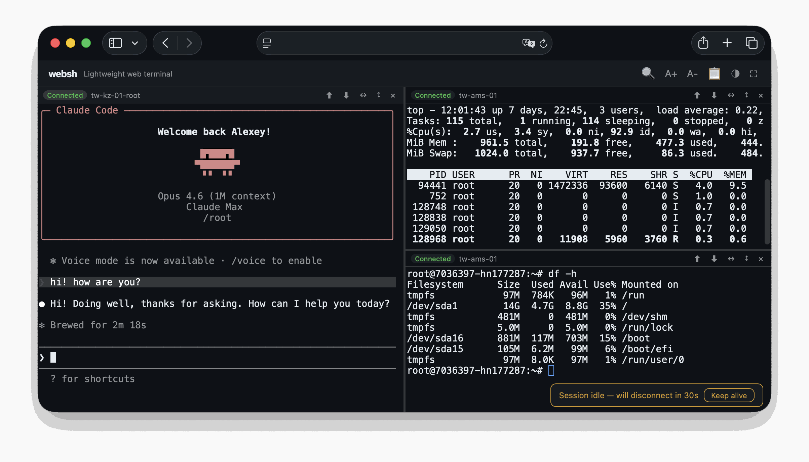

#  websh

[English](README.md) | **Русский**

SSH-терминал в браузере. Обычный HTTP, без сборки, без отдельных сервисов.

- 📦 Без npm, без pip — кладёшь файлы и запускаешь
- 🌐 Корпоративные сети, где открыт только HTTPS: работает без WebSocket
- ⭐ Сессия живёт после закрытия вкладки, перезагрузки и рестарта бэкенда — до 72 ч (через tmux на удалённом хосте)



```
┌─ Your browser ─┐    HTTPS     ┌── websh host ──┐     SSH      ┌──── Remote ────┐
│                │              │                │              │                │
│    xterm.js    │─── POST ────►│   server.py    │◄────────────►│      bash      │
│                │◄─── SSE ─────│    (Python)    │              │     + tmux     │
│                │              │                │              │                │
└────────────────┘              └────────────────┘              └────────────────┘
```

## Как это работает

Три части:

- **Браузер.** xterm.js рисует терминал. Каждое нажатие летит POST-ом на `/api/input`.
- **websh-хост.** `server.py` держит каждое SSH-подключение как PTY-подпроцесс и стримит вывод обратно через Server-Sent Events на `/api/stream`. Тот же процесс отдаёт фронтенд — отдельный веб-сервер не нужен.
- **Удалённый хост.** Куда ты заходишь по SSH. По желанию оборачивается в tmux, чтобы сессия пережила переподключение.

Если прокси буферизирует SSE (бывает на shared-хостинге), клиент переключается на long-polling по `/api/output` для этой сессии. Медленнее, но работает.

Shared-хостинг не даёт держать долгоживущий процесс? Положи `api.php` рядом с `server.py`. PHP-shim запустит бэкенд при первом запросе и будет проксировать API-вызовы к нему.

**Почему не WebSocket?** Многие shared-хостинги его не проксируют — websh должен работать и там. SSE даёт ту же низкую задержку поверх обычного HTTP и проходит через любой HTTPS-прокси без апгрейда протокола.

Глубже про устройство — детектор буферизации, защита от потери байт при дисконнекте, ожидание через selectors — см. [`docs/sse-transport.md`](docs/sse-transport.md).

## Требования

- **Бэкенд.** Python 3.9+ с `ssh` в PATH. Только stdlib — никаких pip-зависимостей.
- **Браузер.** Любой современный. xterm.js грузится с CDN.
- **Постоянные сессии (опционально).** `tmux` на удалённом хосте —
  любая более-менее свежая версия. См.
  [`docs/persistent-sessions.md`](docs/persistent-sessions.md).
- **Опциональный proxy на shared-хостинге.** PHP 5.3+ с расширением `curl`.
- **Опциональный reverse-proxy.** nginx, Caddy или Apache.

## Особенности

### 🖥️ Терминал

Настоящий xterm.js — копирование выделением, вставка правой кнопкой и по `Ctrl+V` (включено по умолчанию; в ⚙ Options можно выключить, чтобы в shell уходил обычный `^V`), поиск по скроллбэку (`Ctrl+Shift+F`), масштаб (`Ctrl+±`), полноэкранный режим (`F11`).

- Разделение на панели, горизонтально и вертикально, с перетаскиваемыми разделителями
- Переключение панелей: `Ctrl+Tab` / `Ctrl+Shift+Tab`
- Выбор шрифта (⚙) с живым предпросмотром — JetBrains Mono, Fira Code, IBM Plex Mono, Roboto Mono, Source Code Pro, Inconsolata или системный. Кастомный размер, межстрочный, начертание

### 🔁 Постоянные сессии

Поставь галочку **Persistent session** при подключении — websh обернёт shell в tmux-сессию на удалённом хосте. Закрой вкладку, перезагрузи компьютер, перезапусти `server.py`: панель переподключится к той же tmux-сессии со скроллбэком и работающими процессами. См. [`docs/persistent-sessions.md`](docs/persistent-sessions.md).

- При разрыве — одна спокойная плашка с кнопкой реконнекта; неверный пароль или ключ открывает окно для повторного ввода, а не зацикливается
- URL-якоря (`#connect=Production`) для прямых ссылок и закладок
- Сохранённые подключения в `localStorage` браузера

### 🛡️ Надёжность

- **Ничего не теряется при переподключении.** Вывод читается по курсору из буфера повтора: оборвавшийся поток, уснувший ноутбук или прокси, разорвавший соединение, продолжают ровно с того места — без пропусков и дублей.
- **Символы приходят в том порядке, в котором набраны.** Для каждой панели в пути только один запрос с вводом; набранное за это время уходит следующей пачкой.
- **Само восстанавливается после смены Wi-Fi или сна.** Соединение, оборвавшееся «молча», не вызывает ошибки в браузере. websh замечает это за секунды — по сигналу от сервера, по позиции вывода в каждом ответе на ввод, по событиям сети и пробуждения в браузере — и перезапускает канал вывода; страницу обновлять не нужно.
- **Долгое отсутствие стоит нескольких секунд.** Если сессия на сервере истекла, persistent-панель сама возвращается в тот же tmux-shell, а набранное за это время доставляется, когда tmux готов. В *новый* shell старые нажатия не отправляются никогда.
- **Перезапуск или деплой websh никого не отключает.** Панели находят свои сессии на перезапущенном сервере.
- **Транспорт восстанавливается сам.** Закрытый SSE-поток переоткрывается автоматически; если прокси буферизует SSE, панель переходит на long-polling, в фоне продолжает пробовать поток и возвращается на него, когда он заработал; кратковременные сетевые ошибки повторяются, а не завершают сессию.
- **Чистое завершение.** Дочерний ssh всегда собирается (никаких зомби, занимающих слоты сессий), простаивающие сессии закрываются по таймауту, последний вывод сессии доставляется до того, как она помечена завершённой, а клиент, оборвавший запрос, — штатная ситуация, а не ошибка сервера.

### 📁 Передача файлов

Загрузка и скачивание без `scp`.

- **Загрузка.** Выбираешь файлы; браузер стримит байты через пиггибэк-канал SSH ControlMaster (`cat > $HOME/<tmp>` без PTY, без base64) кусками по 4 МБ, каждый с повтором и докачкой с того места, где кончился предыдущий, — корпоративный прокси или VPN, обрывающий долгие запросы, больше не заставляет переключать сеть, чтобы загрузить файл. На постоянных (tmux) панелях файл попадает в `pane_current_path` автоматически — vim/less/htop в фоне не дёргаются. Не-постоянные панели набирают `mv` в активный шелл с защитой от alt-screen. Авто-инкремент при коллизии имён. Прогресс через xhr.upload, очередь, отмена в полёте.
- **Скачивание.** Выделяешь имя файла в терминале, нажимаешь Download.
- **Файловый браузер.** Открывается в той папке, где панель сейчас находится, а не в `$HOME` — путь берётся из сигнала OSC 7 от шелла либо из `pane_current_path` на tmux-панелях. Кликабельные хлебные крошки, живой фильтр по имени, переключатель скрытых файлов. Сортировка по имени, размеру или дате (по умолчанию сначала новые; выбор запоминается). В каждой строке **переименование** (✎) и **удаление** (✕, с подтверждением в два шага, никогда не рекурсивно), плюс **создание папки** — всё без нажатий в PTY, через SSH-side-channel, так что полноэкранная программа в панели не дёргается.
- **Экспорт скроллбэка.** Сохраняет текущий буфер в текстовый файл. На постоянных панелях берёт реальный tmux-скроллбэк через `tmux capture-pane`.

### 🔐 Профили подключений

От свободного «введи хост и поехали» до строго ограниченного click-to-connect. См. [`docs/server-side-connections.md`](docs/server-side-connections.md).

- Аутентификация по паролю и SSH-ключу
- Серверные профили в `websh.json` — креды остаются на сервере, браузер их не видит
- Два типа: **Ready** (сохранённые креды) и **Prompt** (целевой хост из allowlist, пользователь сам вводит пароль)
- `allowed_users` / `denied_users` для каждого профиля
- SSH-опции для отдельных профилей (`ProxyJump`, `StrictHostKeyChecking`, …)
- `restrict_hosts: true` полностью прячет свободную форму

### 🚀 Развёртывание

- **Shared-хостинг.** Заливаешь по FTP 4 файла + `assets/`; `api.php` сам стартует бэкенд. SSH на хост не нужен.
- **Только Python.** Бэкенд сам отдаёт фронтенд — ноль зависимостей.
- **Docker, systemd, reverse-proxy.** Рецепты в [`docs/deployment.md`](docs/deployment.md).
- Транспорт по обычному HTTP с автоматическим fallback на long-poll для хостов, которые буферизируют SSE.

## Сценарии

- **Корпоративный фаервол.** SSH-порт закрыт, открыт только HTTPS. websh туннелит через стандартный HTTPS.
- **Нет родного терминала.** Chromebook, iPad, kiosk. Любой браузер становится терминалом.
- **Доступ для клиента.** Даёшь клиенту ссылку на его собственный сервер. URL-якоря (`#connect=ServerName`) для прямых ссылок.
- **UI на bastion.** Ставишь websh на jump-host, ходишь во внутренние серверы из любого браузера.
- **Аварийный доступ с чужой машины.** Открыл URL — ты внутри.
- **Воркшопы.** Студентам не нужно ничего ставить локально.

## Быстрый старт (на своей машине)

```bash
git clone https://github.com/dolonet/websh.git
cd websh
python3 server.py
```

Открой http://localhost:8765 — всё. Без pip install, без npm, без сборки.

Нужны Python 3.9+ и `ssh` в PATH. По умолчанию сервер слушает
`127.0.0.1`; задай `HOST=0.0.0.0`, чтобы выставить его в локальную сеть.

## Быстрый старт (shared-хостинг)

**SSH-доступ не требуется.** Залей `index.html`, `websh.js`, `api.php`,
`server.py` и папку `assets/` в папку в веб-корне. Открой в браузере.
`api.php` сам запускает `server.py` при первом запросе.

`websh.json` (опционально, для серверных подключений) лежит **вне**
веб-корня — `api.php` по умолчанию ищет на два каталога выше себя.
Переопределяется через `WEBSH_CONFIG=/path/to/websh.json`.

Полная раскладка каталогов, решение проблем и нюансы пути конфига —
[`docs/deployment.md`](docs/deployment.md).

## Настройка

Большинству развёртываний нужно поменять только это:

```bash
PORT=8765           # порт для прослушивания
HOST=127.0.0.1      # адрес для bind (0.0.0.0 — в LAN)
WEBSH_CONFIG=...    # путь к websh.json (api.php автодетектит)
```

Полная таблица переменных окружения (rate-limits, лимиты сессий,
idle-TTL tmux, путь access-log…): [`docs/configuration.md`](docs/configuration.md).

## Развёртывание

- **Shared-хостинг (PHP + Python)** — FTP-drop 4 файлов + `assets/`. См. [`docs/deployment.md`](docs/deployment.md#shared-hosting-php--python).
- **Только Python** — `python3 server.py` для локального использования; перед публикацией поставь TLS/auth reverse proxy. См. [`docs/deployment.md`](docs/deployment.md#python-only-no-php).
- **Docker** — `docker build -t websh . && docker run -d -p 127.0.0.1:8765:8765 websh`. См. [`docs/deployment.md`](docs/deployment.md#docker).
- **systemd** — unit `websh.service` в комплекте. См. [`docs/deployment.md`](docs/deployment.md#systemd).
- **HTTPS через reverse-proxy** — nginx / Caddy впереди для TLS. См. [`docs/deployment.md`](docs/deployment.md#https-via-reverse-proxy).

## Безопасность

**У websh намеренно нет встроенной аутентификации** — добавь её на
уровне веб-сервера (`auth_basic`, Cloudflare Access, Tailscale Funnel,
IP-allowlist'ы и т. д.). Threat-model, rate-limit'ы, формат JSON
access-log'а, интеграция с fail2ban, обработка host-keys и
ограничения сохранённых паролей — в [`docs/security.md`](docs/security.md).

## Документация

| Тема | Файл |
|---|---|
| Серверные профили подключений | [`docs/server-side-connections.md`](docs/server-side-connections.md) |
| Постоянные сессии (tmux) | [`docs/persistent-sessions.md`](docs/persistent-sessions.md) |
| Аутентификация и безопасность | [`docs/security.md`](docs/security.md) |
| Справочник по конфигурации | [`docs/configuration.md`](docs/configuration.md) |
| Рецепты развёртывания | [`docs/deployment.md`](docs/deployment.md) |
| Дизайн SSE-транспорта | [`docs/sse-transport.md`](docs/sse-transport.md) |
| Детекция auth-failure | [`docs/auth-fail-detection.md`](docs/auth-fail-detection.md) |

## Структура проекта

```
index.html                Фронтенд — xterm.js терминал + UI подключений
websh.js                  Логика фронтенда — управление панелями, передача файлов
api.php                   PHP-прокси — пробрасывает запросы браузера на бэкенд (опционально)
server.py                 Python-бэкенд — управляет SSH-сессиями через PTY, отдаёт фронтенд
assets/                   Бренд-SVG (логотип) загружаемый index.html
websh.json.example        Пример серверного конфига
test_server.py            Совместимый запускатель тестов бэкенда
tests/backend/            Тесты бэкенда — unit + integration (unittest)
tests/frontend/           Тесты фронтенда на jsdom
tests/php/                Smoke-тест PHP-прокси
tests/e2e/                Сценарии в браузере: настоящий Chromium, настоящий ssh, сбои сети
scripts/                  check.sh (все тесты), e2e.sh, deploy.sh, codemap.py
AGENTS.md                 Руководство для контрибьюторов и код-агентов
.github/workflows/        CI: матрица бэкенда, фронтенд, PHP, ruff, Docker
docs/                     Заметки по архитектуре и справочная документация
Dockerfile                Развёртывание в контейнере
websh.service             unit-файл для systemd
LICENSE                   MIT-лицензия
```

## Тесты

```bash
# Бэкенд (Python, только stdlib — unittest): ~680 тестов
python3 -m unittest discover -s tests/backend -t .   # или: python3 test_server.py -v

# Фронтенд (Node 20 + jsdom): ~1170 проверок
cd tests/frontend && npm install && npm test

# PHP-прокси (нужен php-cli с curl) и линтер
php -l api.php && bash tests/php/smoke.sh
ruff check .

# Всё перечисленное, с одним вердиктом
scripts/check.sh

# Сценарии в браузере: смена Wi-Fi, сон, перезапуск, порядок ввода (tests/e2e/README.md)
scripts/e2e.sh
```

CI прогоняет всё это на каждый push и PR: бэкенд на Python 3.9 и 3.12, каждый с `cryptography` и без (опциональная зависимость хранилища), плюс фронтенд, smoke-тест PHP, ruff и сборку Docker-образа с проверкой `/api/ping`, `/api/config` и страницы.

Покрытие `server.py` тестами бэкенда (строки + ветвления) — около 88%:

```bash
pip install coverage
coverage run --branch --include=server.py -m unittest discover -s tests/backend -t .
coverage report
```

Наборы тестов детерминированы: пути ввода-вывода бэкенда проверяются на сценарных сессиях, а не на задержках; фронтенд-обвязка ждёт собственного сигнала загрузки приложения; необработанный reject засчитывается как провал текущего сценария, а не обрывает прогон молча. Зелёный прогон — это `failed: 0`, любой другой результат — красный.

## Лицензия

MIT
